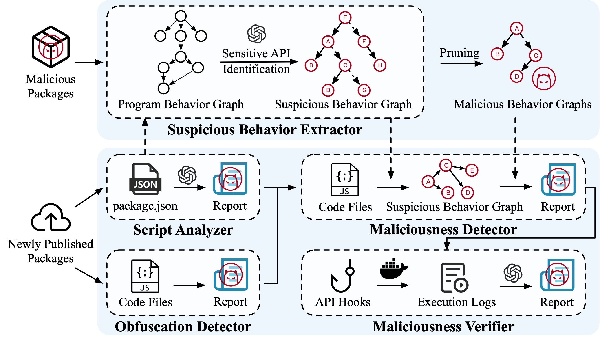

# SpiderScan

SpiderScan: Practical Detection of Malicious NPM Packages Based on Graph-Based Behavior Modeling and Matching



## Introduction

This project identifies malicious NPM packages based on graph-based behavior modeling and matching. Given a target package, SpiderScan constructs its suspicious behavior graphs and matches them with malicious behavior graphs, and uses dynamic analysis and LLM to confirm the maliciousness for certain malicious behaviors.

## Prerequisite

### Basic

- Ubuntu 22.04.4 LTS
- Docker

### Dependencies

To run the project locally, you need dependencies as follows:

- [Joern](https://joern.io/) 2.0.260
- Python 3.9.18
  - install the dependencies via: `pip install -r requirements.txt`

## Structure

- *dataset* folder contains the dataset. The samples were collected from [Backstabbers-Knife-Collection](https://dasfreak.github.io/Backstabbers-Knife-Collection/), [Maloss-samples](https://github.com/osssanitizer/maloss) and grey literature (e.g., blogs and news).
- *comment* folder contains the source code related to the function extraction.
- *common_classes* folder contains source code related to the objects for the building of the graphs.
- *csv* folder contains the data about the API info, including the package name, API name, comment, category, and code.
- *npm_pipeline* folder contains source code for sensitive graph extraction, including the processing logic.
- *obfuscation_detection* folder contains source code for obfuscation detection, including the detection model.

## Analysis

- Set the api_key in the *llm.py*
- To analyze a given NPM package:

```
python analyse.py
-base_dir            base directory, where the format directory and run logs will be generated.
-package_dir         the directory contains the NPM package.
-package_name        the name of the package.
-report_dir          the directory contains the results of analysis.
-joern_workspace     the directory contains the output of Joern export.
```
The command below will dump the JSON result into the *report_dir*.

## Supplemental evaluation of the obfuscation detector

The evaluation of the effectiveness of the obfuscation detector is presented here.
we compare the DONAPI[^1], JAST[^2], JSTAP[^3], and choose the *ngrams_ast* and *value_tokens* approach in JSTAP as they perform best in the paper.

The results of the effectiveness evaluation of the obfuscation detector are shown in the table below, which follows the dataset setup in RQ1.

**Effectiveness Evaluation Results of Obfuscation Detector (RQ1)**

| Tools               | Precision | Recall | F1    |
| ------------------- | --------- | ------ | ----- |
| SpiderScan          | 98.3%     | 82.6%  | 89.4% |
| DONAPI              | 86.3%     | 66.2%  | 74.1% |
| JAST                | 98.3%     | 67.0%  | 78.4% |
| JSTAP(ngrams_ast)   | 99.9%     | 65.1%  | 77.4% |
| JSTAP(value_tokens) | 58.9%     | 59.8%  | 58.5% |

We obtained the obfuscation malicious code from JSTAP and the benign code from the top 5000 download packages. We randomly selected 1500 obfuscation and non-obfuscation samples from the two sets as our dataset. The results are shown in the table below:

**Effectiveness Evaluation Results of Obfuscation Detector**

| Tools               | Precision | Recall | F1    |
| ------------------- | --------- | ------ | ----- |
| SpiderScan          | 99.9%     | 97.2%  | 98.6% |
| DONAPI              | 98.6%     | 97.5%  | 98.0% |
| JAST                | 99.9%     | 96.7%  | 98.3% |
| JSTAP(ngrams_ast)   | 99.9%     | 96.1%  | 98.0% |
| JSTAP(value_tokens) | 99.9%     | 96.0%  | 97.9% |


[^1]: DONAPI: Malicious NPM Packages Detector using Behavior Sequence Knowledge Mapping.
[^2]: JaSt: Fully Syntactic Detection of Malicious (Obfuscated) JavaScript.
[^3]: JStap: A Static Pre-Filter for Malicious JavaScript Detection.